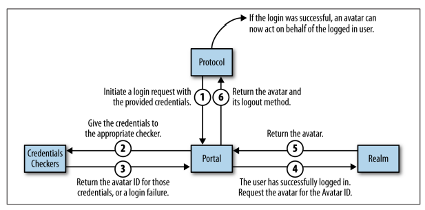

# SSH Server Using Twisted library in Python 3

` Note ` : This is only the explanation for my code. I am not responsible to anything that you do.

## Why not socket?

I know that, when I showcase my project with twisted, I get questions like, why only twisted?, why not socket? etc.

## Reasons 
   - Socket needs to code in both client and server side, which is not possible in real-life scenario like a honeypot.
   - Socket doesn't allow us to emulate the features of the rel-life shell, whereas twisted does it with the help of ` HistoricRecvLine `
   - socket doesnot allows us to exchange the public key in the SSH protocol.

# Working 

1. ` SSH Protocol  ` - It defines the rules & regulations for the SSH protocol, which inherits HistoricRecvLine class. This class contains default methods like `lineReceived`, `connectionMade` and `connectionLost`. We need to override those methods, to obtain desired features of SSH protocol.
   - ### Features of Historic RecvLine : 
            a. Modern shell features like command history. (with cursor uparrow and downarrow)
            b. Changes the look into a real life model.

2. ` avatar.ConchUser ` - This class contains the actions available to an authenticated SSH user. To make it possible for the user to get a shell, make the user’s avatar implement twisted.conch.interfaces.ISession

    You have to perform a few steps to connect the client’s protocol to your shell protocol so they can communicate with each other - 

    a. To setup your protocol to the user's session,  wrap your protocol in a twisted.conch.insults.insults.ServerProtocol object.

    b. Usually, the client's protocol expects an interface to connect with, as we are using a protocol, `makeConnection` implements twisted.internet.interfaces.ITransport interface.
   
3. ` SSHRealm ` - Create a class that has a requestAvatar method. The SSH server will call requestAvatar with the username as avatarId and twisted.conch.interfaces.IAvatar as one of the interfaces. This returns the subclass of twisted.conch.avatar.ConchUser. 

## Authenticating the User - 

## Final Steps - 

To run the SSH server, create a twisted.conch.ssh.factory.SSHFactory object. 

Set its portal attribute to a portal using your realm, and register a credentials checker that can handle twisted.cred.credentials.IUsernamePassword credentials. 

Set the SSHFactory’s publicKeys attribute to a dictionary that matches encryption algorithms to keys.

Call reactor.listenTCP to start listening on a port, and then these is SSH server running on the given port. 